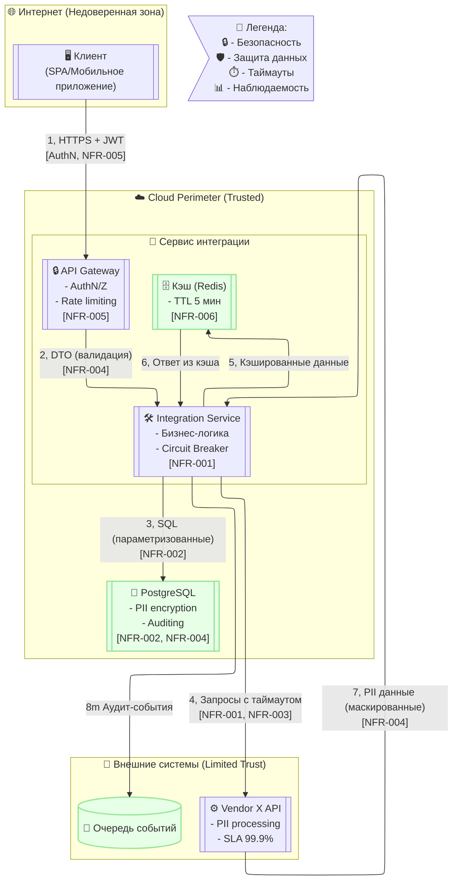

# S04 - DFD

```mermaid
---
config:
  layout: elk
---
flowchart TD
 subgraph Internet["🌐 Интернет (Недоверенная зона)"]
        U[["🖥️ Клиент<br>(SPA/Мобильное приложение)"]]
  end
 subgraph App["🚀 Сервис интеграции"]
        A[["🔒 API Gateway<br>- AuthN/Z<br>- Rate limiting<br>[NFR-005]"]]
        S[["🛠️ Integration Service<br>- Бизнес-логика<br>- Circuit Breaker<br>[NFR-001]"]]
        C[["🗄️ Кэш (Redis)<br>- TTL 5 мин<br>[NFR-006]"]]
  end
 subgraph Cloud["☁️ Cloud Perimeter (Trusted)"]
        App
        D[["💾 PostgreSQL<br>- PII encryption<br>- Auditing<br>[NFR-002, NFR-004]"]]
  end
 subgraph External["📡 Внешние системы (Limited Trust)"]
        X[["⚙️ Vendor X API<br>- PII processing<br>- SLA 99.9%"]]
        Q[("📨 Очередь событий")]
  end
    U -- "1, HTTPS + JWT<br>[AuthN, NFR-005]" --> A
    A -- "2, DTO (валидация)<br>[NFR-004]" --> S
    S -- "3, SQL (параметризованные)<br>[NFR-002]" --> D
    S -- "4, Запросы с таймаутом<br>[NFR-001, NFR-003]" --> X
    S -- 5, Кэшированные данные --> C
    C -- 6, Ответ из кэша --> S
    X -- "7, PII данные (маскированные)<br>[NFR-004]" --> S
    S -- "8m Аудит-события" --> Q
    legend>"📌 Легенда:
  🔒 - Безопасность
  🛡️ - Защита данных
  ⏱️ - Таймауты
  📊 - Наблюдаемость"]
     C:::storage
     D:::storage
     Q:::storage
    classDef internet fill:#ffecec,stroke:#ff9999,stroke-width:2px
    classDef cloud fill:#e6f3ff,stroke:#99ccff,stroke-width:2px
    classDef external fill:#fffae6,stroke:#ffcc66,stroke-width:2px
    classDef storage fill:#e6ffe6,stroke:#99e699,stroke-width:2px
```
